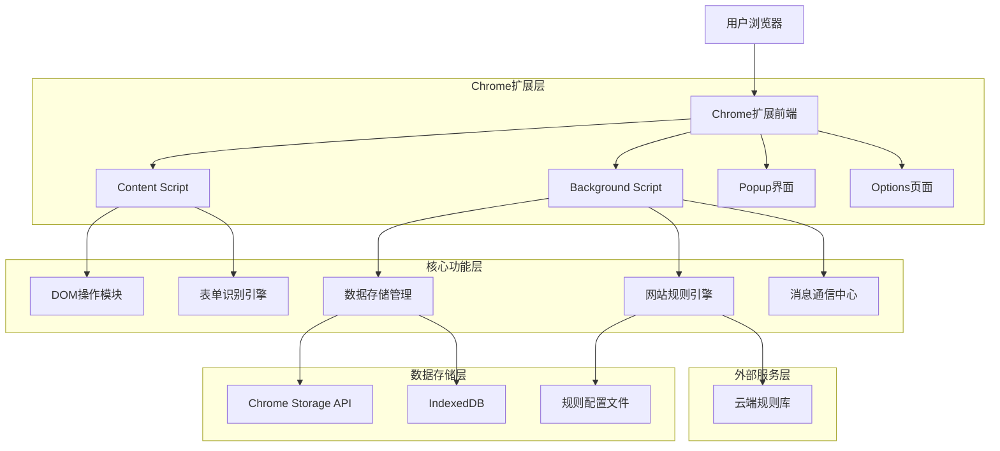
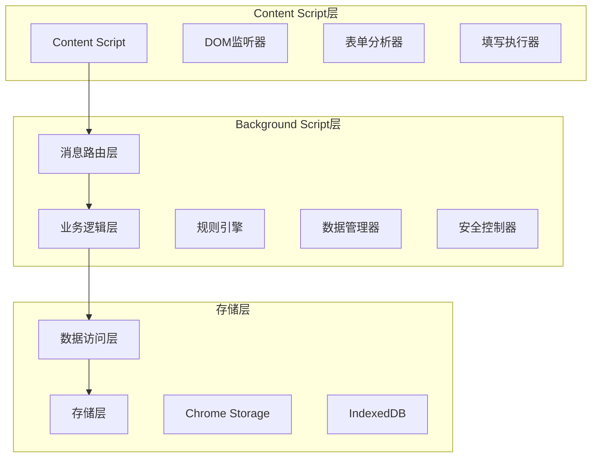
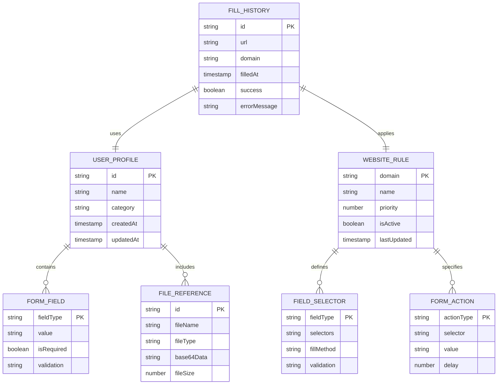

# JianCareer AutoFill - 智能自动填表Chrome扩展技术架构文档

## 1. Architecture design



## 2. Technology Description

* **前端框架**: React\@18 + TypeScript + Tailwind CSS + Vite

* **Chrome扩展**: Manifest V3 + Chrome Extension APIs

* **数据存储**: Chrome Storage API + IndexedDB

* **构建工具**: Vite + Chrome Extension Plugin

* **状态管理**: Zustand

* **UI组件**: Headless UI + Radix UI

* **图标库**: Lucide React

## 3. Route definitions

| Route              | Purpose                 |
| ------------------ | ----------------------- |
| /popup             | 扩展弹窗主界面，显示当前页面填表状态和快速操作 |
| /options           | 扩展设置页面，管理用户信息模板和全局配置    |
| /options/profiles  | 信息模板管理页面，创建和编辑个人信息      |
| /options/websites  | 网站适配管理页面，查看支持网站和自定义规则   |
| /options/settings  | 全局设置页面，安全选项和行为配置        |
| /options/analytics | 统计分析页面，使用数据和历史记录        |

## 4. API definitions

### 4.1 Core API

**Chrome扩展内部消息通信**

```typescript
// 消息类型定义
interface ExtensionMessage {
  type: 'DETECT_FORMS' | 'FILL_FORM' | 'GET_PROFILES' | 'SAVE_PROFILE' | 'GET_SETTINGS';
  payload?: any;
  tabId?: number;
}

// 表单检测消息
interface DetectFormsMessage {
  type: 'DETECT_FORMS';
  payload: {
    url: string;
    domain: string;
  };
}

// 填写表单消息
interface FillFormMessage {
  type: 'FILL_FORM';
  payload: {
    profileId: string;
    fields: FormField[];
    options: FillOptions;
  };
}
```

**数据模型接口**

```typescript
// 用户信息模板
interface UserProfile {
  id: string;
  name: string;
  category: 'personal' | 'professional' | 'custom';
  fields: {
    firstName: string;
    lastName: string;
    email: string;
    phone: string;
    address: Address;
    education: Education[];
    experience: WorkExperience[];
    skills: string[];
    files: FileReference[];
  };
  createdAt: Date;
  updatedAt: Date;
}

// 网站规则配置
interface WebsiteRule {
  domain: string;
  name: string;
  selectors: FieldSelector[];
  actions: FormAction[];
  priority: number;
  isActive: boolean;
}

// 字段选择器
interface FieldSelector {
  fieldType: 'firstName' | 'lastName' | 'email' | 'phone' | 'address';
  selectors: string[]; // CSS选择器数组
  fillMethod: 'value' | 'input' | 'select' | 'file';
  validation?: string; // 验证正则表达式
}
```

## 5. Server architecture diagram



## 6. Data model

### 6.1 Data model definition



### 6.2 Data Definition Language

**Chrome Storage数据结构**

```typescript
// 用户配置存储
interface StorageSchema {
  // 用户信息模板
  profiles: {
    [profileId: string]: UserProfile;
  };
  
  // 网站规则配置
  websiteRules: {
    [domain: string]: WebsiteRule;
  };
  
  // 全局设置
  settings: {
    autoFill: boolean;
    fillDelay: number;
    confirmBeforeFill: boolean;
    autoSubmit: boolean;
    encryptData: boolean;
    syncEnabled: boolean;
  };
  
  // 使用统计
  analytics: {
    totalFills: number;
    successRate: number;
    lastUsed: Date;
    monthlyStats: MonthlyStats[];
  };
}

// IndexedDB表结构
interface IndexedDBSchema {
  // 填写历史表
  fillHistory: {
    keyPath: 'id';
    indexes: {
      domain: string;
      filledAt: Date;
      success: boolean;
    };
  };
  
  // 文件存储表
  fileStorage: {
    keyPath: 'id';
    indexes: {
      profileId: string;
      fileType: string;
      uploadedAt: Date;
    };
  };
}
```

**初始化数据**

```typescript
// 默认网站规则配置
const defaultWebsiteRules: WebsiteRule[] = [
  {
    domain: 'linkedin.com',
    name: 'LinkedIn',
    selectors: [
      {
        fieldType: 'firstName',
        selectors: ['input[name="firstName"]', '#firstName'],
        fillMethod: 'value'
      },
      {
        fieldType: 'email',
        selectors: ['input[type="email"]', 'input[name="email"]'],
        fillMethod: 'input'
      }
    ],
    actions: [
      {
        actionType: 'click',
        selector: 'button[type="submit"]',
        delay: 1000
      }
    ],
    priority: 1,
    isActive: true
  },
  {
    domain: 'zhipin.com',
    name: 'Boss直聘',
    selectors: [
      {
        fieldType: 'phone',
        selectors: ['input[placeholder*="手机"]', 'input[name="mobile"]'],
        fillMethod: 'input'
      }
    ],
    actions: [],
    priority: 1,
    isActive: true
  }
];

// 默认设置
const defaultSettings = {
  autoFill: false,
  fillDelay: 500,
  confirmBeforeFill: true,
  autoSubmit: false,
  encryptData: true,
  syncEnabled: false
};
```

**安全考虑**

1. **数据加密**: 敏感信息使用AES-256加密存储
2. **权限控制**: 最小权限原则，仅请求必要的Chrome API权限
3. **数据隔离**: 不同网站的数据完全隔离，防止跨站数据泄露
4. **输入验证**: 所有用户输入进行严格验证和过滤
5. **安全传输**: 云端同步使用HTTPS加密传输
6. **本地存储**: 敏感数据仅存储在本地，不上传到服务器
7. **权限提示**: 填写前向用户明确展示将要填写的信息
8. **自动清除**: 支持定时清除填写历史和临时数据

