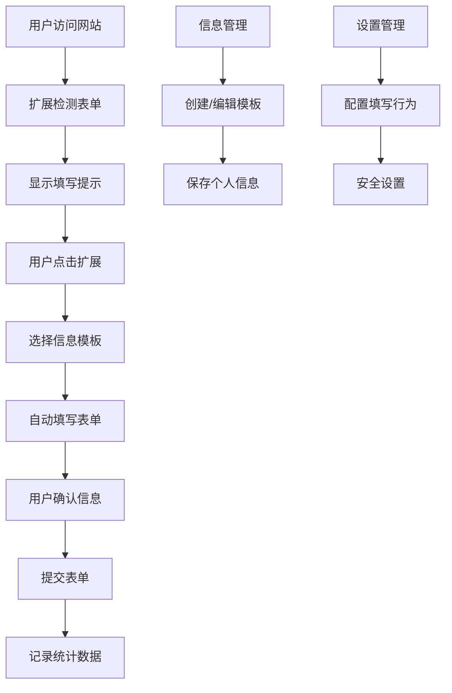

# JianCareer AutoFill - 智能自动填表Chrome扩展产品需求文档

## 1. Product Overview
JianCareer AutoFill是一款智能自动填表Chrome扩展，帮助用户在各种网站上快速、准确地填写表单信息，特别针对求职申请、注册表单等场景进行优化。
- 解决用户在多个网站重复填写相同信息的痛点，提高填表效率，减少人工错误。
- 目标用户为求职者、频繁注册用户和需要批量填表的商务人士，预期提升填表效率80%以上。

## 2. Core Features

### 2.1 智能表单检测
- JianCareer AutoFill 能够自动识别网页中的表单字段

### 2.2 一键自动填写
- 用户点击 JianCareer AutoFill 扩展图标后

### 2.3 多网站适配
- JianCareer AutoFill 支持主流求职网站

### 2.4 用户信息管理
- JianCareer AutoFill 提供安全的用户信息存储

### 2.5 实时填写预览
- JianCareer AutoFill 在填写前显示预览

### 2.6 User Roles
| Role | Registration Method | Core Permissions |
|------|---------------------|------------------|
| 免费用户 | Chrome扩展安装后自动创建 | 基础自动填表、最多保存3套个人信息模板 |
| 高级用户 | 付费升级或邀请码 | 无限信息模板、智能表单识别、批量操作、数据导入导出 |

### 2.2 Feature Module
我们的自动填表扩展包含以下主要页面：
1. **主控制面板**：扩展弹窗界面，显示当前页面填表状态、快速操作按钮、设置入口。
2. **信息管理页面**：用户个人信息模板管理，支持多套信息配置、分类管理。
3. **网站适配管理**：显示支持的网站列表、自定义规则配置、适配状态监控。
4. **设置页面**：扩展全局设置、安全选项、数据同步配置。
5. **统计分析页面**：填表历史记录、效率统计、使用报告。

### 2.3 Page Details
| Page Name | Module Name | Feature description |
|-----------|-------------|---------------------|
| 主控制面板 | 页面检测模块 | 自动识别当前页面表单字段，显示可填写字段数量和匹配度 |
| 主控制面板 | 快速填写模块 | 一键填写按钮，选择信息模板，实时填写预览 |
| 主控制面板 | 状态指示器 | 显示扩展运行状态、网站支持程度、填写进度 |
| 信息管理页面 | 模板管理 | 创建、编辑、删除个人信息模板，支持分类标签 |
| 信息管理页面 | 字段配置 | 详细配置姓名、邮箱、电话、地址、教育经历、工作经验等字段 |
| 信息管理页面 | 文件管理 | 上传和管理简历、证书等文件，支持多格式 |
| 网站适配管理 | 支持网站列表 | 显示已适配网站，包括LinkedIn、Indeed、Boss直聘等主流平台 |
| 网站适配管理 | 自定义规则 | 用户自定义网站字段映射规则，CSS选择器配置 |
| 网站适配管理 | 规则测试 | 测试自定义规则有效性，实时预览填写效果 |
| 设置页面 | 安全设置 | 数据加密选项、自动清除设置、权限管理 |
| 设置页面 | 同步设置 | 云端数据同步、备份恢复、多设备同步 |
| 设置页面 | 行为设置 | 填写速度、确认提示、自动提交等行为配置 |
| 统计分析页面 | 使用统计 | 填表次数、节省时间、成功率等数据展示 |
| 统计分析页面 | 历史记录 | 填表历史、网站访问记录、错误日志 |

## 3. Core Process

**用户操作流程：**
1. 用户安装扩展后，首次使用需要创建个人信息模板
2. 访问支持的网站时，扩展自动检测表单并在右下角显示提示
3. 用户点击扩展图标，选择合适的信息模板
4. 扩展智能识别表单字段并自动填写
5. 用户确认信息无误后可选择自动提交或手动提交
6. 系统记录填写历史并更新统计数据

## 4. User Interface Design

### 4.1 Design Style
- **主色调**：#4A90E2（专业蓝）、#F5F7FA（浅灰背景）
- **辅助色**：#28A745（成功绿）、#DC3545（警告红）、#FFC107（提示黄）
- **按钮样式**：圆角矩形（border-radius: 6px），渐变背景，悬停效果
- **字体**：系统默认字体栈，主要文字14px，标题16-18px，说明文字12px
- **布局风格**：卡片式设计，顶部导航，左侧边栏（设置页面），响应式布局
- **图标风格**：线性图标风格，统一2px线宽，支持深色/浅色主题

### 4.2 Page Design Overview

| Page Name | Module Name | UI Elements |
|-----------|-------------|-------------|
| 主控制面板 | 页面检测模块 | 圆形进度环显示匹配度，绿色表示高匹配，橙色表示部分匹配，灰色表示不支持 |
| 主控制面板 | 快速填写模块 | 大号蓝色按钮"一键填写"，下拉选择信息模板，实时预览卡片 |
| 信息管理页面 | 模板管理 | 卡片式模板展示，每个模板显示名称、创建时间、使用次数，支持拖拽排序 |
| 信息管理页面 | 字段配置 | 分组表单设计，基本信息、联系方式、教育背景、工作经验四个Tab页 |
| 网站适配管理 | 支持网站列表 | 网格布局显示网站Logo和名称，绿色勾号表示完全支持，黄色表示部分支持 |
| 设置页面 | 安全设置 | 开关按钮控制各项安全选项，密码强度指示器，数据加密状态显示 |
| 统计分析页面 | 使用统计 | 仪表盘式数据展示，柱状图显示月度使用趋势，饼图显示网站使用分布 |

### 4.3 Responsiveness
扩展主要面向桌面Chrome浏览器，采用固定宽度设计（380px），高度自适应内容。弹窗界面针对不同屏幕分辨率进行优化，确保在1366x768及以上分辨率下完美显示。设置页面采用响应式设计，支持全屏显示时的布局调整。