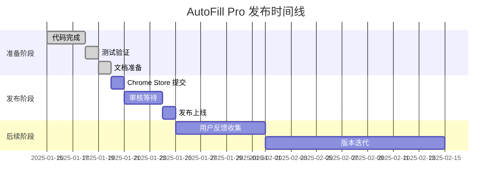

# AutoFill Pro 线上部署完整指导

本文档提供 AutoFill Pro Chrome 扩展线上部署的完整指导，包括 Chrome Web Store 发布、替代分发方式和最佳实践。

## 📋 目录

- [部署概览](#-部署概览)
- [Chrome Web Store 发布](#-chrome-web-store-发布)
- [替代分发方式](#-替代分发方式)
- [发布前检查清单](#-发布前检查清单)
- [发布流程详解](#-发布流程详解)
- [发布后管理](#-发布后管理)
- [常见问题解决](#-常见问题解决)
- [最佳实践](#-最佳实践)

---

## 🌐 部署概览

### 📊 部署方式对比

| 部署方式 | 推荐指数 | 用户覆盖 | 维护成本 | 安全性 | 更新便利性 |
|----------|----------|----------|----------|--------|------------|
| Chrome Web Store | ⭐⭐⭐⭐⭐ | 最广 | 低 | 最高 | 自动 |
| GitHub Releases | ⭐⭐⭐⭐ | 中等 | 中 | 高 | 手动 |
| 企业内部分发 | ⭐⭐⭐ | 限定 | 高 | 可控 | 管理员控制 |
| 开发者模式 | ⭐⭐ | 极少 | 高 | 中等 | 手动 |
| 私有服务器 | ⭐ | 自定义 | 最高 | 可控 | 自定义 |

### 🎯 推荐部署策略

**个人开发者**:
1. 主要渠道: Chrome Web Store
2. 备用渠道: GitHub Releases
3. 测试渠道: 开发者模式

**企业用户**:
1. 内部分发: 企业策略部署
2. 公开版本: Chrome Web Store
3. 定制版本: 私有服务器

**开源项目**:
1. 官方发布: Chrome Web Store
2. 开发版本: GitHub Releases
3. 社区贡献: 开发者模式

---

## 🏪 Chrome Web Store 发布

### 📋 发布准备清单

#### ✅ 必需文件
- [ ] `manifest.json` (符合 Manifest V3 规范)
- [ ] 扩展源代码 (已构建和优化)
- [ ] 图标文件 (16x16, 48x48, 128x128 像素)
- [ ] 应用截图 (1280x800 或 640x400 像素，最多 5 张)
- [ ] 宣传图片 (440x280 像素，可选)
- [ ] 隐私政策文档
- [ ] 使用条款文档

#### 📝 商店信息
- [ ] 扩展名称 (最多 45 个字符)
- [ ] 简短描述 (最多 132 个字符)
- [ ] 详细描述 (最多 16,000 个字符)
- [ ] 类别选择
- [ ] 语言设置
- [ ] 年龄分级

#### 🔒 合规检查
- [ ] 权限使用合理性
- [ ] 隐私政策完整性
- [ ] 内容政策合规性
- [ ] 安全漏洞检查
- [ ] 性能优化验证

### 🚀 发布流程

#### 第一步: 开发者账户

```bash
# 1. 访问 Chrome Web Store 开发者控制台
https://chrome.google.com/webstore/devconsole/

# 2. 注册开发者账户 (一次性费用 $5)
# 3. 验证身份信息
# 4. 设置付款信息 (如果计划收费)
```

#### 第二步: 准备扩展包

```bash
# 构建生产版本
pnpm run build

# 创建发布包
zip -r AutoFill-Pro-v1.0.0.zip dist/

# 验证包内容
unzip -l AutoFill-Pro-v1.0.0.zip
```

#### 第三步: 上传和配置

1. **上传扩展包**
   - 点击 "新增项目"
   - 上传 ZIP 文件
   - 等待自动验证

2. **填写商店信息**
   ```
   名称: AutoFill Pro - 智能自动填表助手
   简短描述: 一键自动填写网页表单，支持求职网站，提升效率，保护隐私
   类别: 生产力工具
   语言: 中文 (简体), English
   ```

3. **上传图标和截图**
   - 主图标: `store-assets/icons/icon-128.png`
   - 应用截图: `store-assets/screenshots/`
   - 宣传图片: `store-assets/promo/promo-440x280.png`

4. **设置隐私实践**
   ```
   数据收集: 否
   数据使用: 仅本地存储
   第三方服务: 无
   隐私政策: https://your-domain.com/privacy-policy
   ```

#### 第四步: 提交审核

```bash
# 审核时间: 通常 1-3 个工作日
# 审核状态:
# - 待审核 (Pending Review)
# - 审核中 (In Review) 
# - 需要修改 (Needs Action)
# - 已发布 (Published)
# - 被拒绝 (Rejected)
```

### 📊 发布后监控

#### 关键指标
```javascript
// 监控指标
const metrics = {
  downloads: 'Chrome Web Store 下载量',
  activeUsers: '活跃用户数',
  ratings: '用户评分和评论',
  crashes: '崩溃报告',
  performance: '性能指标'
};
```

#### 用户反馈处理
```markdown
## 反馈处理流程
1. 监控用户评论和评分
2. 及时回复用户问题
3. 收集功能改进建议
4. 定期发布更新版本
5. 维护良好的用户关系
```

---

## 🔄 替代分发方式

### 🐙 GitHub Releases

#### 优势
- 版本控制完整
- 开源透明
- 社区参与
- 免费使用

#### 发布流程
```bash
# 1. 创建 Release
git tag -a v1.0.0 -m "Release version 1.0.0"
git push origin v1.0.0

# 2. 构建发布包
pnpm run build
zip -r AutoFill-Pro-v1.0.0.zip dist/

# 3. 生成校验和
sha256sum AutoFill-Pro-v1.0.0.zip > AutoFill-Pro-v1.0.0.zip.sha256

# 4. 上传到 GitHub Releases
# 访问: https://github.com/your-repo/releases/new
```

#### 自动化发布
```yaml
# .github/workflows/release.yml
name: Release
on:
  push:
    tags:
      - 'v*'

jobs:
  release:
    runs-on: ubuntu-latest
    steps:
      - uses: actions/checkout@v3
      - name: Setup Node.js
        uses: actions/setup-node@v3
        with:
          node-version: '18'
      - name: Install dependencies
        run: pnpm install
      - name: Build extension
        run: pnpm run build
      - name: Create release package
        run: |
          zip -r AutoFill-Pro-${{ github.ref_name }}.zip dist/
          sha256sum AutoFill-Pro-${{ github.ref_name }}.zip > AutoFill-Pro-${{ github.ref_name }}.zip.sha256
      - name: Create Release
        uses: softprops/action-gh-release@v1
        with:
          files: |
            AutoFill-Pro-${{ github.ref_name }}.zip
            AutoFill-Pro-${{ github.ref_name }}.zip.sha256
          generate_release_notes: true
```

### 🏢 企业内部分发

#### 组策略部署
```json
// Chrome 企业策略配置
{
  "ExtensionInstallForcelist": [
    "your-extension-id;https://internal-server.company.com/autofill-pro.crx"
  ],
  "ExtensionSettings": {
    "your-extension-id": {
      "installation_mode": "force_installed",
      "update_url": "https://internal-server.company.com/updates.xml",
      "blocked_permissions": ["background"],
      "allowed_permissions": ["storage", "activeTab"]
    }
  }
}
```

#### 内部更新服务器
```javascript
// update-server.js
const express = require('express');
const app = express();

app.get('/updates.xml', (req, res) => {
  const updateXml = `<?xml version='1.0' encoding='UTF-8'?>
<gupdate xmlns='http://www.google.com/update2/response' protocol='2.0'>
  <app appid='${EXTENSION_ID}'>
    <updatecheck codebase='https://internal-server.company.com/autofill-pro-${LATEST_VERSION}.crx' version='${LATEST_VERSION}' />
  </app>
</gupdate>`;
  
  res.set('Content-Type', 'application/xml');
  res.send(updateXml);
});

app.listen(8080);
```

---

## ✅ 发布前检查清单

### 🔍 技术检查

```bash
# 代码质量检查
npm run lint
npm run type-check
npm run test

# 构建验证
npm run build
npm run pack

# 安全扫描
npm audit
npm run security-check

# 性能测试
npm run performance-test
```

### 📋 功能测试

- [ ] **核心功能测试**
  - [ ] 表单检测准确性
  - [ ] 自动填写功能
  - [ ] 数据存储和加密
  - [ ] 用户界面响应

- [ ] **兼容性测试**
  - [ ] Chrome 最新版本
  - [ ] Chrome 88+ 版本
  - [ ] 不同操作系统
  - [ ] 主流网站测试

- [ ] **性能测试**
  - [ ] 内存使用量 < 10MB
  - [ ] 启动时间 < 500ms
  - [ ] 填写响应时间 < 3s
  - [ ] 无内存泄漏

### 🛡️ 安全检查

- [ ] **权限审查**
  - [ ] 最小权限原则
  - [ ] 权限使用说明
  - [ ] 敏感权限避免

- [ ] **数据安全**
  - [ ] 本地数据加密
  - [ ] 无敏感数据泄露
  - [ ] 安全传输协议

- [ ] **代码安全**
  - [ ] 无恶意代码
  - [ ] 依赖库安全
  - [ ] XSS 防护

### 📝 文档检查

- [ ] **用户文档**
  - [ ] 安装指南
  - [ ] 使用教程
  - [ ] 常见问题
  - [ ] 故障排除

- [ ] **法律文档**
  - [ ] 隐私政策
  - [ ] 使用条款
  - [ ] 版权声明
  - [ ] 开源许可

---

## 🔄 发布流程详解

### 📅 发布时间规划



### 🎯 发布策略

#### 渐进式发布
```javascript
// 分阶段发布策略
const releaseStrategy = {
  phase1: {
    target: '内部测试用户',
    percentage: '5%',
    duration: '3天',
    channels: ['GitHub Releases']
  },
  phase2: {
    target: '早期采用者',
    percentage: '20%',
    duration: '1周',
    channels: ['Chrome Web Store (限制发布)']
  },
  phase3: {
    target: '全体用户',
    percentage: '100%',
    duration: '持续',
    channels: ['Chrome Web Store (完全发布)']
  }
};
```

#### A/B 测试
```javascript
// A/B 测试配置
const abTestConfig = {
  testName: 'UI_Layout_Test',
  variants: {
    control: {
      name: '原始界面',
      percentage: 50,
      features: ['original_popup']
    },
    treatment: {
      name: '新界面',
      percentage: 50,
      features: ['new_popup_design']
    }
  },
  metrics: ['user_engagement', 'task_completion', 'user_satisfaction']
};
```

---

## 📊 发布后管理

### 📈 监控和分析

#### 关键指标监控
```javascript
// 监控仪表板
const monitoringMetrics = {
  usage: {
    dailyActiveUsers: 'DAU',
    monthlyActiveUsers: 'MAU',
    sessionDuration: '会话时长',
    featureUsage: '功能使用率'
  },
  performance: {
    loadTime: '加载时间',
    memoryUsage: '内存使用',
    errorRate: '错误率',
    crashRate: '崩溃率'
  },
  business: {
    downloadRate: '下载增长率',
    userRetention: '用户留存率',
    userSatisfaction: '用户满意度',
    supportTickets: '支持工单数'
  }
};
```

#### 数据收集
```javascript
// 匿名使用统计
const analytics = {
  trackEvent: (category, action, label) => {
    // 发送匿名统计数据
    fetch('/api/analytics', {
      method: 'POST',
      body: JSON.stringify({
        category,
        action,
        label,
        timestamp: Date.now(),
        version: chrome.runtime.getManifest().version
      })
    });
  }
};
```

### 🔄 版本更新流程

#### 更新策略
```markdown
## 版本更新类型

### 主版本更新 (Major)
- 重大功能变更
- 不兼容的 API 变更
- 架构重构
- 发布周期: 6-12 个月

### 次版本更新 (Minor)
- 新功能添加
- 功能改进
- 兼容性更新
- 发布周期: 1-3 个月

### 补丁更新 (Patch)
- 错误修复
- 安全更新
- 性能优化
- 发布周期: 1-2 周
```

#### 自动更新机制
```javascript
// Chrome 扩展自动更新
chrome.runtime.onUpdateAvailable.addListener((details) => {
  console.log('New version available:', details.version);
  
  // 提示用户更新
  chrome.notifications.create({
    type: 'basic',
    iconUrl: 'icons/icon-48.png',
    title: 'AutoFill Pro 更新可用',
    message: `新版本 ${details.version} 已准备就绪，点击重启应用更新。`
  });
  
  // 延迟重启以避免中断用户操作
  setTimeout(() => {
    chrome.runtime.reload();
  }, 5000);
});
```

---

## ❓ 常见问题解决

### 🚫 审核被拒常见原因

#### 权限问题
```json
// 问题: 请求了不必要的权限
// 解决: 最小化权限请求
{
  "permissions": [
    "storage",        // ✅ 必需: 数据存储
    "activeTab"       // ✅ 必需: 当前标签页访问
    // "tabs",        // ❌ 移除: 不需要访问所有标签页
    // "<all_urls>"   // ❌ 移除: 不需要访问所有网站
  ]
}
```

#### 内容政策违规
```markdown
## 常见违规和解决方案

### 数据收集
- 问题: 未明确说明数据收集用途
- 解决: 完善隐私政策，明确数据使用范围

### 功能描述
- 问题: 功能描述与实际不符
- 解决: 确保商店描述准确反映扩展功能

### 代码质量
- 问题: 代码混淆或包含恶意内容
- 解决: 提供清晰的源代码，移除可疑内容
```

#### 技术问题
```bash
# 常见技术问题排查

# 1. Manifest 格式错误
jsonlint manifest.json

# 2. 图标尺寸不符
identify icons/*.png

# 3. 权限声明错误
chrome-extension-validator manifest.json

# 4. 代码语法错误
eslint src/**/*.js
```

### 🔧 技术问题排查

#### 扩展无法加载
```javascript
// 调试步骤
const debugSteps = [
  '1. 检查 manifest.json 语法',
  '2. 验证文件路径正确性',
  '3. 确认权限声明完整',
  '4. 查看浏览器控制台错误',
  '5. 检查内容安全策略',
  '6. 验证图标文件存在'
];

// 常见错误和解决方案
const commonErrors = {
  'Manifest file is missing or unreadable': {
    cause: 'manifest.json 文件缺失或格式错误',
    solution: '检查文件存在且 JSON 格式正确'
  },
  'Could not load icon': {
    cause: '图标文件路径错误或文件不存在',
    solution: '确认图标文件路径和文件存在'
  },
  'Permission denied': {
    cause: '权限声明不足或过度',
    solution: '调整 manifest.json 中的权限声明'
  }
};
```

#### 性能问题优化
```javascript
// 性能优化检查清单
const performanceChecklist = {
  memory: {
    issue: '内存使用过高',
    solutions: [
      '移除未使用的依赖',
      '优化数据结构',
      '实现懒加载',
      '清理事件监听器'
    ]
  },
  startup: {
    issue: '启动时间过长',
    solutions: [
      '减少初始化代码',
      '异步加载非关键资源',
      '优化 CSS 和 JS 文件大小',
      '使用 Web Workers'
    ]
  },
  runtime: {
    issue: '运行时性能差',
    solutions: [
      '优化 DOM 操作',
      '减少不必要的计算',
      '实现缓存机制',
      '使用防抖和节流'
    ]
  }
};
```

---

## 🏆 最佳实践

### 📈 用户体验优化

#### 首次使用体验
```javascript
// 新用户引导
const onboardingFlow = {
  step1: {
    title: '欢迎使用 AutoFill Pro',
    content: '让我们快速设置您的第一个信息模板',
    action: 'showProfileSetup'
  },
  step2: {
    title: '选择常用网站',
    content: '选择您经常使用的求职网站',
    action: 'showSiteSelection'
  },
  step3: {
    title: '开始使用',
    content: '访问任意表单页面，点击扩展图标开始填写',
    action: 'completeOnboarding'
  }
};
```

#### 错误处理和反馈
```javascript
// 用户友好的错误处理
const errorHandler = {
  handleError: (error, context) => {
    const userMessage = {
      'FORM_NOT_DETECTED': '未检测到表单，请确认页面已完全加载',
      'PROFILE_NOT_FOUND': '请先创建个人信息模板',
      'NETWORK_ERROR': '网络连接异常，请检查网络设置',
      'PERMISSION_DENIED': '需要页面访问权限，请刷新页面重试'
    };
    
    showNotification({
      type: 'error',
      message: userMessage[error.code] || '操作失败，请重试',
      action: getRecoveryAction(error.code)
    });
  }
};
```

### 🔒 安全最佳实践

#### 数据保护
```javascript
// 数据加密和保护
const securityMeasures = {
  encryption: {
    algorithm: 'AES-256-GCM',
    keyDerivation: 'PBKDF2',
    saltLength: 32,
    iterations: 100000
  },
  storage: {
    location: 'chrome.storage.local',
    encryption: true,
    backup: false,
    sync: false
  },
  permissions: {
    principle: 'least-privilege',
    review: 'quarterly',
    documentation: 'required'
  }
};
```

#### 隐私保护
```javascript
// 隐私保护措施
const privacyProtection = {
  dataCollection: {
    personalData: false,
    usageAnalytics: 'anonymous-only',
    crashReports: 'opt-in',
    telemetry: 'minimal'
  },
  dataSharing: {
    thirdParty: false,
    analytics: 'aggregated-only',
    advertising: false,
    research: 'anonymized-only'
  },
  userControl: {
    dataExport: true,
    dataDeletion: true,
    consentManagement: true,
    transparencyReport: true
  }
};
```

### 📊 质量保证

#### 自动化测试
```javascript
// 测试策略
const testingStrategy = {
  unit: {
    framework: 'Jest',
    coverage: '>90%',
    files: 'src/**/*.test.js'
  },
  integration: {
    framework: 'Puppeteer',
    scenarios: 'tests/integration/**/*.spec.js',
    browsers: ['Chrome', 'Edge']
  },
  e2e: {
    framework: 'Playwright',
    scenarios: 'tests/e2e/**/*.spec.js',
    sites: ['linkedin.com', 'indeed.com']
  },
  performance: {
    tools: ['Lighthouse', 'WebPageTest'],
    metrics: ['FCP', 'LCP', 'CLS', 'FID'],
    thresholds: 'performance.budget.json'
  }
};
```

#### 持续集成
```yaml
# CI/CD 流水线
name: Quality Assurance
on: [push, pull_request]

jobs:
  test:
    runs-on: ubuntu-latest
    steps:
      - uses: actions/checkout@v3
      - name: Setup Node.js
        uses: actions/setup-node@v3
      - name: Install dependencies
        run: pnpm install
      - name: Run linting
        run: pnpm run lint
      - name: Run type checking
        run: pnpm run type-check
      - name: Run unit tests
        run: pnpm run test:unit
      - name: Run integration tests
        run: pnpm run test:integration
      - name: Build extension
        run: pnpm run build
      - name: Run E2E tests
        run: pnpm run test:e2e
      - name: Security audit
        run: pnpm audit
      - name: Performance test
        run: pnpm run test:performance
```

---

## 📞 支持和资源

### 📚 文档资源

- **开发文档**: [Chrome Extension Developer Guide](https://developer.chrome.com/docs/extensions/)
- **API 参考**: [Chrome Extension APIs](https://developer.chrome.com/docs/extensions/reference/)
- **最佳实践**: [Extension Quality Guidelines](https://developer.chrome.com/docs/webstore/quality_guidelines/)
- **政策指南**: [Chrome Web Store Policies](https://developer.chrome.com/docs/webstore/program_policies/)

### 🛠️ 开发工具

- **Chrome DevTools**: 扩展调试和性能分析
- **Extension Reloader**: 开发时自动重载扩展
- **Manifest Validator**: 验证 manifest.json 格式
- **Icon Generator**: 生成不同尺寸的图标

### 🤝 社区支持

- **官方论坛**: [Chrome Extensions Google Group](https://groups.google.com/a/chromium.org/g/chromium-extensions)
- **Stack Overflow**: [chrome-extension 标签](https://stackoverflow.com/questions/tagged/chrome-extension)
- **GitHub 讨论**: [项目讨论区](https://github.com/autofillpro/chrome-extension/discussions)
- **开发者社区**: [Chrome Extension Developers](https://discord.gg/chrome-extensions)

### 📧 联系方式

- **技术支持**: tech-support@autofillpro.com
- **商务合作**: business@autofillpro.com
- **安全报告**: security@autofillpro.com
- **媒体咨询**: media@autofillpro.com

---

## 📝 总结

AutoFill Pro 的线上部署涉及多个方面，从技术准备到用户体验，从安全合规到持续维护。本指导文档提供了完整的部署流程和最佳实践，帮助确保扩展的成功发布和长期运营。

### 🎯 关键成功因素

1. **质量第一**: 确保扩展功能完整、性能优秀、安全可靠
2. **用户体验**: 提供直观易用的界面和流畅的交互体验
3. **合规运营**: 严格遵守平台政策和法律法规要求
4. **持续改进**: 基于用户反馈不断优化和更新
5. **社区建设**: 建立活跃的用户社区和开发者生态

### 🚀 未来展望

随着 Web 技术的发展和用户需求的变化，AutoFill Pro 将持续演进，为用户提供更智能、更安全、更便捷的自动填表体验。我们期待与用户和开发者社区一起，共同打造更好的产品。

---

**文档版本**: 1.0  
**最后更新**: 2025年1月20日  
**适用版本**: AutoFill Pro 1.0.0+  
**维护团队**: AutoFill Pro 开发团队